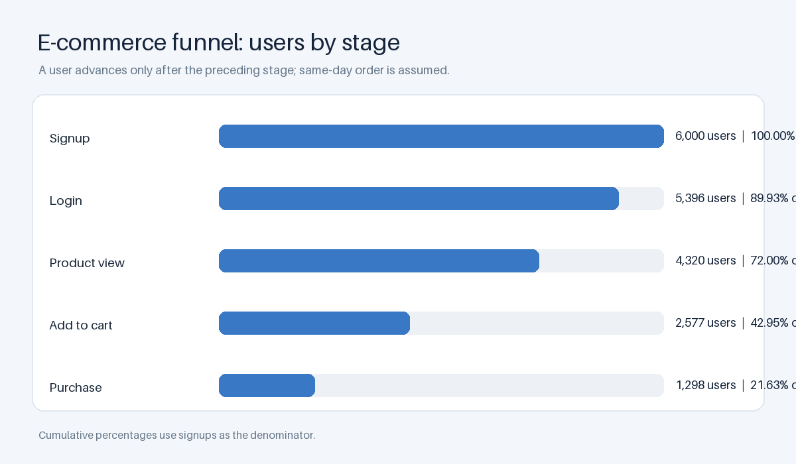
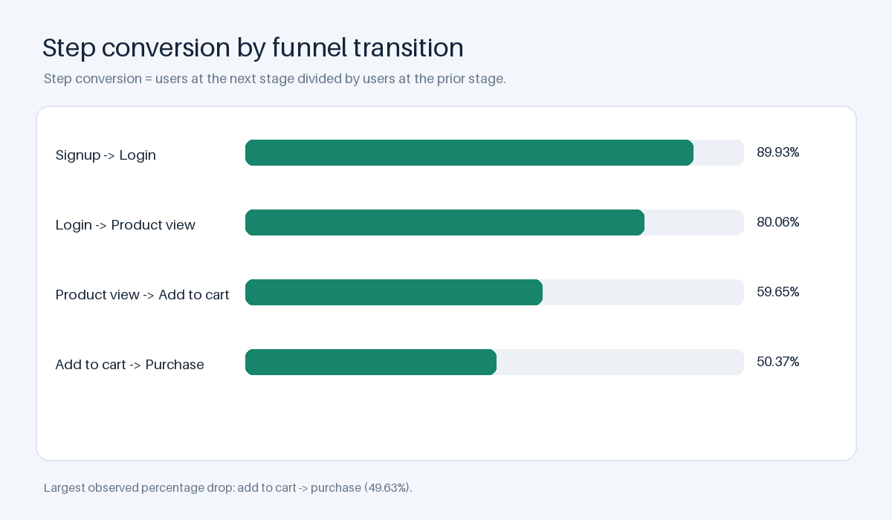
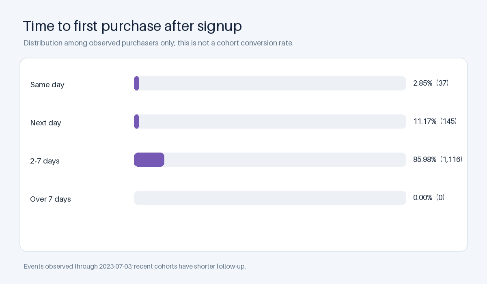

# E-Commerce Product Funnel Analytics

An account-level funnel analysis using MySQL, a bundled cleaned event sample, and reproducible Python-built CSV and PNG artifacts.

The dataset appears synthetic and is intended for portfolio demonstration. Its original publisher and generator were not recorded, so the results are illustrative and should not be treated as findings about a real store.

## Tech stack

- MySQL 8 for the schema, data loading, and analysis queries.
- Python 3.12 and the standard library for input checks and CSV artifacts.
- Pillow 12.3.0 for reproducible PNG charts and the static dashboard preview.
- GitHub Actions and SQLFluff 4.4.0 for SQL linting and result validation.

## What is included

- MySQL schema, data load, funnel, timing, country, and mature-cohort SQL.
- User and event CSV inputs. The original raw data and cleaning process are not included.
- A Python reference build that validates the inputs and regenerates all result CSVs, charts, and the dashboard preview.
- A MySQL result validator used by the local workflow and CI.
- A static dashboard preview at dashboard/dashboard.png. There is no Power BI project file or published dashboard link in this repository.

## Questions and metric definitions

The analysis measures unique users at each account-level stage: signup, login, product view, add to cart, and purchase. It reports both step conversion and cumulative conversion from signup.

| Stage | Users | Step conversion | Cumulative from signup |
| --- | ---: | ---: | ---: |
| Signup | 6,000 | 100.00% | 100.00% |
| Login | 5,396 | 89.93% | 89.93% |
| Product view | 4,320 | 80.06% | 72.00% |
| Add to cart | 2,577 | 59.65% | 42.95% |
| Purchase | 1,298 | 50.37% | 21.63% |

The largest step drop in this sample is from add to cart to purchase: 49.63% of users who added to cart did not have a recorded purchase. The source records dates rather than timestamps, so same-day stages are treated as eligible in the listed order. The data cannot confirm the within-day order.

## Purchase timing and observation window

Among the 1,298 users with an observed purchase after signup, 37 purchased on the same date, 145 the next day, and 1,116 between two and seven days after signup. These percentages describe observed purchasers only; they are not conversion probabilities for all signup cohorts.

The latest event date is July 3, 2023. Users who signed up after June 26 do not have a complete seven-day observation window. The comparable seven-day measure therefore includes only users signed up on or before June 26: 1,270 of 5,896 converted within seven days (21.54%).

## Country results

These are descriptive account-level signup-to-purchase rates. The dataset contains no experiment or statistical test that establishes whether country differences are meaningful or explains their causes.

| Country | Users | Purchases after signup | Conversion |
| --- | ---: | ---: | ---: |
| Germany | 1,003 | 227 | 22.63% |
| India | 1,048 | 232 | 22.14% |
| Australia | 956 | 208 | 21.76% |
| Canada | 949 | 205 | 21.60% |
| USA | 1,079 | 228 | 21.13% |
| UK | 965 | 198 | 20.52% |

The results suggest hypotheses to investigate, such as checking the cart-to-purchase experience or testing onboarding changes. They do not show that a discount, email campaign, or localization change will cause a lift. Those ideas should be evaluated with controlled experiments.

## Reproduce the project

Requirements: Python 3.12, Docker Compose v2, and GNU Make for the Makefile shortcuts.

1. Copy .env.example to .env and set MYSQL_ROOT_PASSWORD to a strong local password. The database port is bound to localhost only.
2. Install the pinned Python dependencies:

        python -m pip install -r requirements-dev.txt

3. Start MySQL and wait for its health check:

        make up

4. Execute and validate the SQL results, then regenerate the CSV and PNG artifacts:

        make run-queries

5. Stop the local database:

        make down

To regenerate artifacts from the checked-in data without MySQL, run python scripts/build_artifacts.py. To check that the committed artifacts are current, run python scripts/build_artifacts.py --check. To validate against a running host MySQL instance, set MYSQL_HOST, MYSQL_PORT, MYSQL_USER, and MYSQL_PWD, then run python scripts/validate_results.py --mode host.

The CSV inputs use LF line endings, enforced by .gitattributes. The schema and load scripts run during first-time MySQL container initialization. Removing the container with make down also removes its local database; the source CSV files remain unchanged.

## Limitations

- The dataset appears synthetic; its original source and generation process are undocumented.
- Only dates are available, not event timestamps. The funnel assumes same-day events follow the listed stage order.
- Events have no session, order, product, quantity, or price identifiers. This project cannot measure session-level funnels, revenue, or product performance.
- Recent signup cohorts have shorter follow-up. The seven-day conversion result uses only cohorts with a complete seven-day observation period.
- The country comparisons and recommendations are descriptive. No causal or statistical-significance claim is made.

## Project files

    data/                 Cleaned user and event CSV inputs
    sql/                  MySQL schema, load, and analysis queries
    scripts/              Data checks, artifact generation, and SQL-result validation
    outputs/              CSV results and reproducible charts
    dashboard/            Static dashboard preview and notes

## Author

GitHub: [omkark2404](https://github.com/omkark2404)
