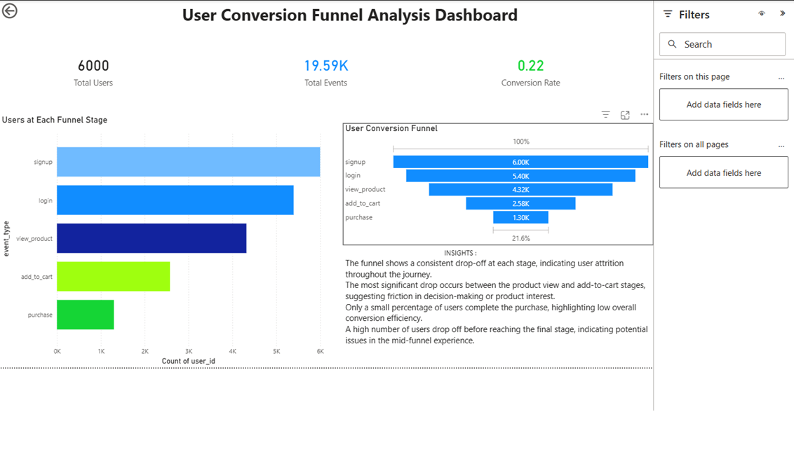

# E-Commerce Product Funnel Analytics

---

## Project Overview

A strategic analysis of an e-commerce user journey designed to pinpoint friction in the conversion funnel. Utilizing SQL for deep data exploration and Power BI for visualization, this project uncovers actionable insights to optimize the path-to-purchase and maximize product revenue.

---

## Business Problem

Many users sign up for a product but do not complete the purchase journey.

This project answers:

* How many users progress through each stage of the funnel?
* Where do users drop off?
* What is the overall conversion rate?
* Which stage needs optimization?

---

## Dataset Description

### 🧾 Users Table

* `user_id` — Unique identifier
* `signup_date` — Date of signup
* `country` — User location

### 📌 Events Table

* `user_id` — User identifier
* `event_type` — Funnel stage (signup, login, view_product, add_to_cart, purchase)
* `event_date` — Date of event

---

##  Key Insights

* A consistent drop-off is observed at each stage of the funnel.
* The most significant drop occurs between the product view and add-to-cart stages.
* Only a small percentage of users complete the purchase journey.
* Mid-funnel optimization presents the biggest opportunity for improving conversions.

---

## 📊 Dashboard Features

* KPI metrics: Total Users, Total Events, Conversion Rate
* Funnel visualization of user journey
* Stage-wise user comparison
* Clean and intuitive layout for quick decision-making

---

## 🛠 Tools & Technologies

* SQL (Data analysis & querying)
* Power BI (Dashboard & visualization)

---

##  Project Structure

```text
E-Commerce-Product-Funnel-Analytics-main/
│
├── data/
│   ├── product_users_clean.csv
│   └── product_events_clean.csv
│
├── sql/
│   └── product_user_behavior_analysis.sql
│
├── dashboard/
│   └── dashboard.png
│
└── README.md
```

---

## 🛠️ How to Run the Analysis

1. **Database Setup**: Open a MySQL environment (or compatible SQL tool) and run the `CREATE DATABASE` commands found in `sql/product_user_behavior_analysis.sql`. *(Note: The script uses MySQL-specific syntax like `USE` and `DATEDIFF`)*.
2. **Data Import**: Import the datasets from the `data/` folder (`product_users_clean.csv` and `product_events_clean.csv`) into your SQL database. You can use your database management tool's import wizard for this.
3. **Execute Queries**: Run the queries sequentially in `sql/product_user_behavior_analysis.sql` to generate the funnel metrics, conversion rates, and stage-to-stage drop-off analysis.
4. **Dashboard**: The output data from the SQL queries can be loaded into Power BI to create visualizations similar to `dashboard/dashboard.png`.

---

## Dashboard Preview



---

## 💼 Skills Demonstrated

* Data analysis using SQL
* Funnel analysis and conversion tracking
* Data visualization with Power BI
* Business problem solving
* Insight generation and storytelling

---

## 🚀 Conclusion

This project demonstrates how data-driven analysis can identify bottlenecks in user conversion and help improve product performance through targeted optimizations.
